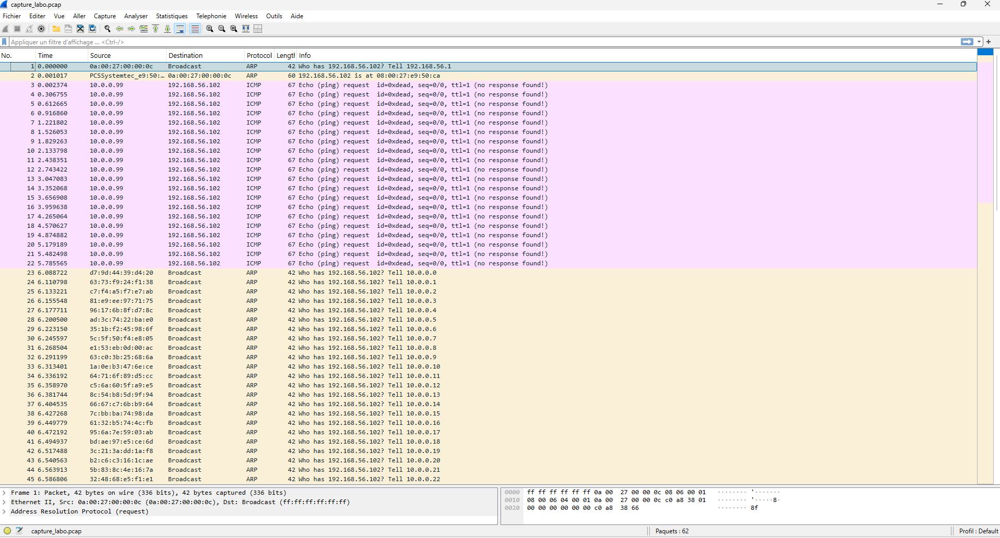

# 🛡️ Scapy Spoofing & Sniffing Lab

Un laboratoire Python utilisant **Scapy** pour simuler des attaques réseau de couche 2 (ARP) et couche 3 (ICMP), avec capture du trafic en temps réel pour l'analyse et la détection de menaces.

## 🎯 Contexte

Ce projet a été réalisé dans le cadre d'un stage en cybersécurité à l'**Entente Valabre** au sein de la **Division Innovation et Prospective**.

L'objectif était de comprendre concrètement les vulnérabilités des protocoles réseau de bas niveau (ARP, ICMP) en les reproduisant dans un environnement isolé, afin de mieux appréhender les mécanismes de détection utilisés dans les outils SIEM et IDS (Snort, Suricata, Wazuh).

## ✨ Fonctionnalités

* **Multi-threading synchronisé :** Utilise `threading.Event` pour s'assurer que le module de capture (Sniffer) est pleinement actif avant de déclencher les injections de paquets.
* **Spoofing ICMP (Couche 3) :** Génération de paquets *Echo Request* (Ping) malformés avec usurpation de l'IP source (`10.0.0.99`) et un TTL anormalement bas (`TTL=1`).
* **ARP Flooding (Couche 2) :** Inondation de requêtes ARP (*who-has*) en modifiant dynamiquement l'IP fantôme et en forçant des adresses MAC aléatoires (`RandMAC()`) cohérentes entre les couches Ethernet et ARP.
* **Analyse & Détection automatique :** Inspection en mémoire des trames brutes à la recherche d'une signature numérique spécifique (`SPOOFED_ICMP_PAYLOAD_LABO`).
* **Export Forensique PCAP :** Sauvegarde automatique des paquets interceptés dans un fichier `.pcap` compatible avec Wireshark.

## 🚀 Installation & Prérequis

### Prérequis
Le script nécessite des privilèges d'administration (root sur Linux, Administrateur sur Windows) pour forger et injecter des trames réseau.

> ⚠️ **Windows uniquement :** Le driver [Npcap](https://npcap.com) est **obligatoire** avant tout lancement. Sans lui, Scapy ne peut pas accéder aux couches réseau basses.

### Dépendances
Installez la bibliothèque Scapy :
```bash
pip install scapy

```

## 💻 Utilisation

Le script propose trois modes d'exécution via des arguments en ligne de commande :

### 1. Mode Complet automatisé (Recommandé)

Lance la capture en tâche de fond, attend sa liaison à l'interface, puis injecte les attaques.

```bash
# Exemple sur Windows (Invite de commandes Admin)
python spoofing_lab.py --mode all --target 192.168.56.102 --count 20 --duration 30 --verbose

# Exemple sur Linux
sudo python3 spoofing_lab.py --mode all --target 192.168.56.102 --count 20 --duration 30 --verbose

```

### 2. Mode Attaque Seule

```bash
sudo python3 spoofing_lab.py --mode send --target 192.168.56.102

```

### 3. Mode Capture Seule

```bash
sudo python3 spoofing_lab.py --mode capture --duration 20

```

## ⚙️ Arguments

| Argument | Défaut | Description |
|---|---|---|
| `--mode` | `all` | Mode d'exécution : `send`, `capture`, `all` |
| `--target` | `192.168.56.101` | IP de la machine cible |
| `--spoof-ip` | `10.0.0.99` | IP source falsifiée pour l'ICMP |
| `--iface` | Auto | Interface réseau |
| `--count` | `10` | Nombre de paquets à envoyer |
| `--duration` | `15` | Durée de la capture (secondes) |
| `--pcap` | `capture_labo.pcap` | Fichier d'export PCAP |
| `--verbose` | `False` | Affichage détaillé en temps réel |

## 📊 Résultats & Analyse Wireshark

Le script génère un résumé de capture dans le terminal et exporte un fichier `capture_labo.pcap` analysable sous Wireshark.

Voici un aperçu visuel du trafic généré par le script et intercepté dans Wireshark :

<p align="center">
  
</p>

* **Zone Rose :** Paquets ICMP falsifiés provenant de la source `10.0.0.99` avec un identifiant marqué `0xdead`.
* **Zone Jaune :** Storm de requêtes ARP générant des adresses MAC et des adresses sources séquentielles (`10.0.0.x`).


## ⚠️ Avertissement légal

Cet outil est développé à des fins **éducatives et de recherche en environnement isolé** (machines virtuelles en réseau host-only).  Toute utilisation sur un réseau sans autorisation explicite de son propriétaire est **strictement interdite** et peut constituer une infraction pénale (article 323-1 du Code pénal français).  
L'auteur décline toute responsabilité quant à une utilisation hors cadre autorisé.
